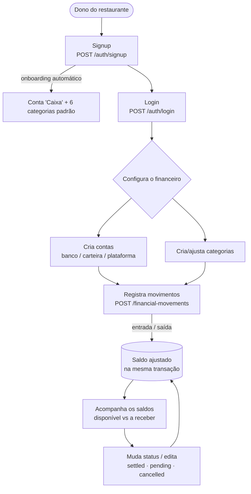

# Jornada do usuário

O caminho típico de um dono de restaurante no Mintly, do cadastro ao acompanhamento do caixa. Cada passo mapeia para rotas da [API](../sistema/api/mintly-api.md).

## Fluxo de ponta a ponta

## O que acontece em cada etapa

| Etapa | Rota | O que o sistema faz |
|---|---|---|
| **Cadastro** | `POST /auth/signup` | cria usuário + restaurante + conta "Caixa" + 6 categorias, tudo numa transação; devolve os tokens |
| **Login** | `POST /auth/login` | autentica; emite access (15min) + refresh (7d) |
| **Configurar** | `/financial-accounts`, `/financial-categories` | cria contas (banco/carteira/plataforma) e categorias |
| **Registrar** | `POST /financial-movements` | lança entrada/saída e **ajusta o saldo da conta** no mesmo commit |
| **Acompanhar** | `GET /financial-movements` | lista movimentos; o saldo vive em 2 buckets (disponível / a receber) |
| **Manter** | `PATCH /financial-movements/:id/status` | muda o status corrigindo o bucket do saldo |

Detalhe técnico do registro e do ciclo de status em [Movimentações](../sistema/api/movimento.md).
