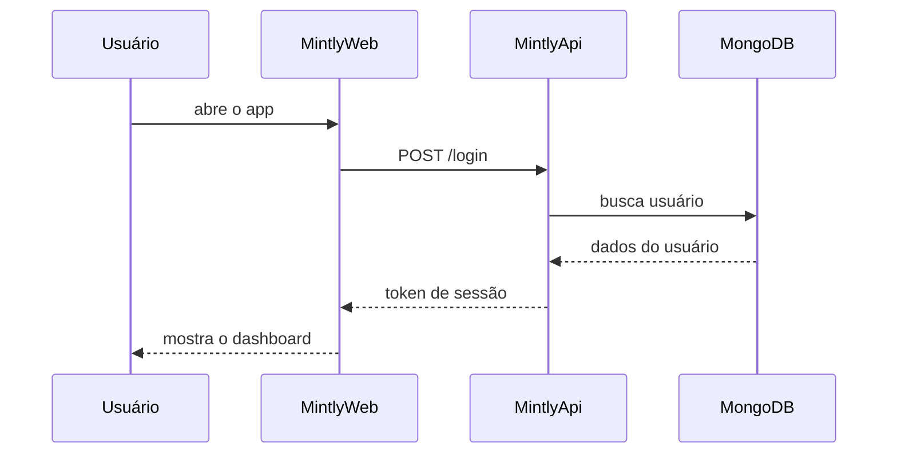
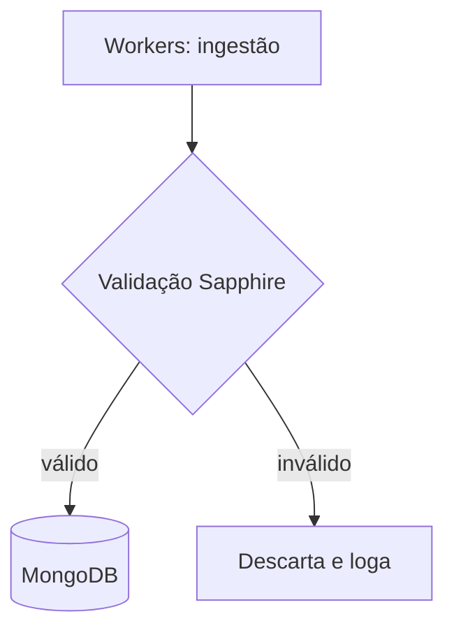

# Jornada do usuário (exemplo Mermaid)

Este documento é um teste do render de **Mermaid**. Abaixo, um diagrama de
sequência de um login simplificado e um fluxograma de ingestão de dados.

## Login (diagrama de sequência)

## Ingestão de dados (fluxograma)

Se os diagramas acima aparecem desenhados (e não como bloco de código), o
Mermaid está funcionando. 🎉
