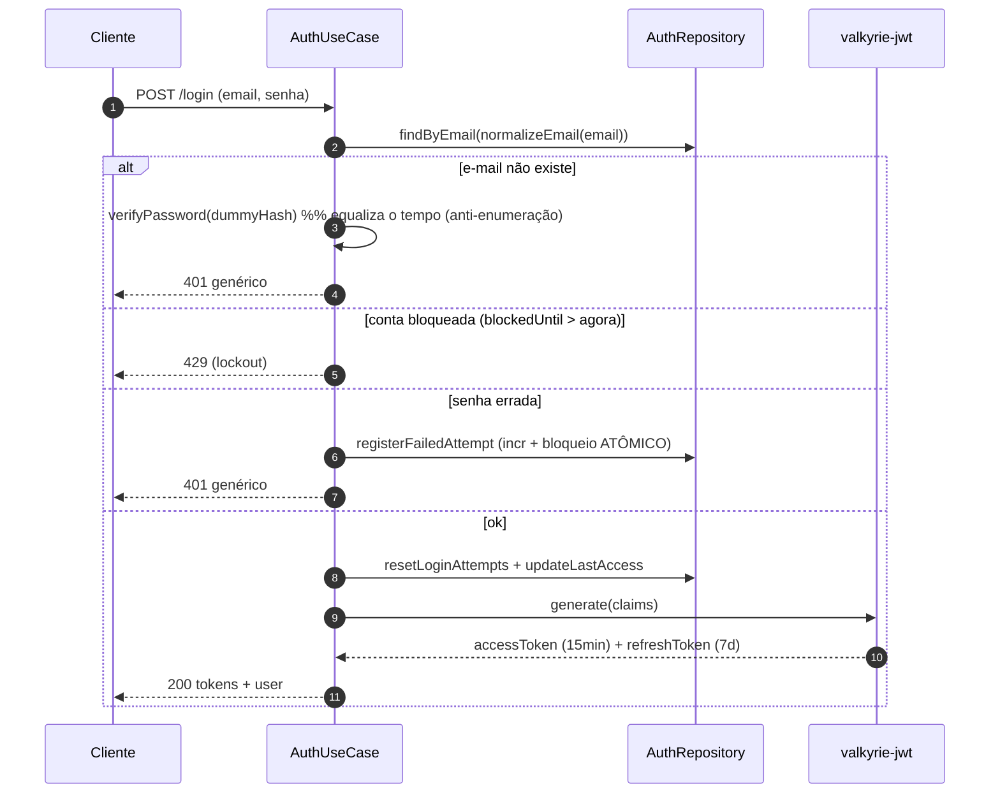
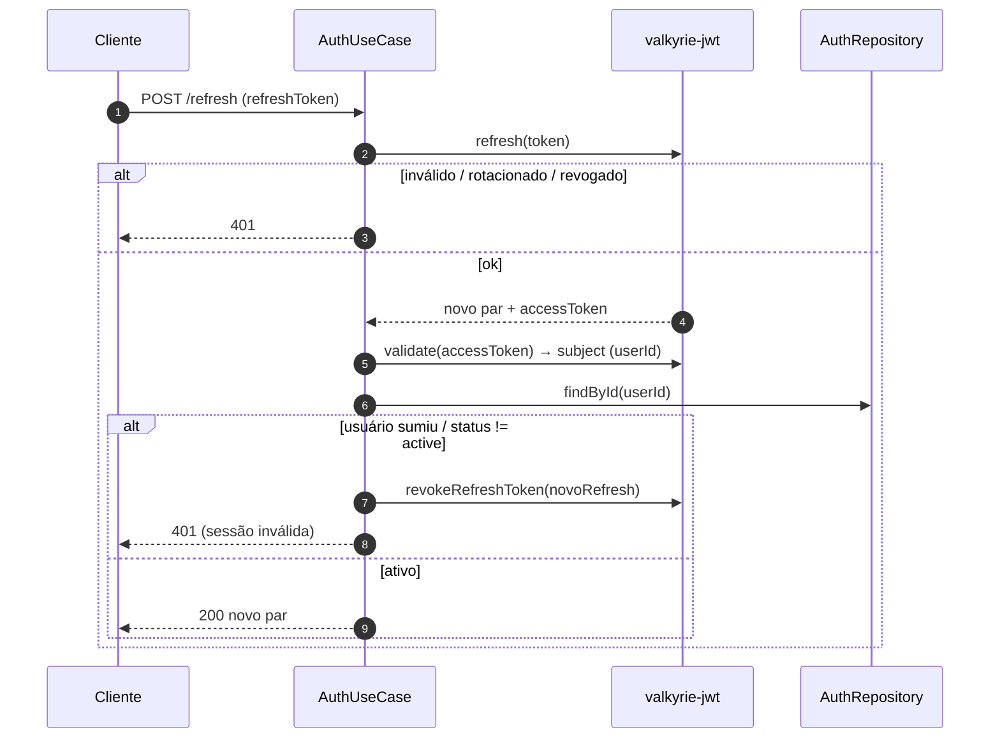
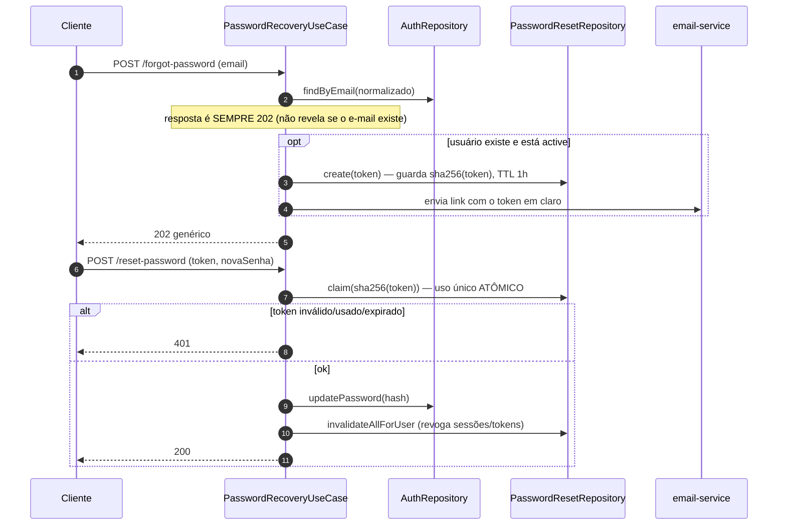

# 🔐 MintlyApi — auth & sessão

Autenticação por e-mail/senha, sessão com JWT criptografado (valkyrie-jwt), lockout contra brute-force e recuperação de senha por e-mail de uso único.

---

## Senha — hashing

Fonte única em `app/auth/password-hash.ts`:

```ts
hashPassword(pwd)   // scrypt(pwd, salt16, 64) → "salt:hash" (salt aleatório por senha)
verifyPassword(pwd, stored)  // comparação em tempo constante (timingSafeEqual)
```

- **scrypt** (N-cost alto) com salt de 16 bytes por senha, guardado no formato `salt:hash`.
- `verifyPassword` compara em **tempo constante** e devolve `false` (não lança) para hash malformado/corrompido — evita 500 no login por dado ruim (B2).
- Política de senha (≥8, maiúscula, minúscula, número) vem do `passwordSchema` da [mintly-lib](../libs/mintly-lib.md).

---

## Signup — onboarding transacional

O cadastro cria **tudo de uma vez** numa transação Mongo: pessoa, restaurante, usuário, a conta "Caixa" padrão, 6 categorias padrão e 4 eventos de auditoria. Se qualquer passo falhar, **nada** é gravado.


O **JWT é emitido depois do commit** (M4): a valkyrie persiste o refresh token no store dela, fora do escopo transacional do Mongo — gerar dentro deixaria um token órfão a cada retry da transação. A transação captura os IDs; o `jwt.generate` roda em seguida.

## Login + lockout



Pontos-chave:

- **Anti-enumeração por timing (M1):** quando o e-mail não existe, roda o mesmo scrypt de senha errada (`DUMMY_PASSWORD_HASH`) — o 401 custa ~o mesmo tempo, não revelando quais e-mails existem.
- **E-mail normalizado (M2):** `normalizeEmail` (trim + lowercase) na busca e no cadastro — evita contas duplicadas/login que falha por caixa.
- **Lockout atômico (M3/A1):** `registerFailedAttempt` faz o incremento de `loginAttempts` **e** o bloqueio (ao cruzar `MAX_LOGIN_ATTEMPTS`) numa **única operação** (update com pipeline de agregação), sem corrida entre contar e bloquear. Ao bloquear, **zera o contador** — senão, ao expirar a janela, a próxima tentativa errada re-bloqueava na hora (DoS da conta legítima).
- **Status só depois da senha:** conta inativa/bloqueada só é revelada (403) **após** a senha correta — antes é o 401 genérico (não dá pra enumerar contas inativas).

Envs: `MAX_LOGIN_ATTEMPTS` (5), `BLOCK_DURATION_MINUTES` (15).

---

## Sessão — JWT com rotação

- **valkyrie-jwt**: access token criptografado (AES-256-GCM), **15 min**; refresh token **7 dias** com **rotação** — cada refresh emite um par novo e o refresh antigo é invalidado. Reuso de um refresh já rotacionado é detectado e a família é negada.
- Os refresh tokens vivem nas coleções `valkyrie_*` (infra da lib).

### Refresh — reconsulta o usuário (C5)



Sem essa reconsulta, quem foi **desativado/bloqueado/rebaixado depois do login** continuaria emitindo access tokens válidos por até 7 dias (só os claims congelados rotacionariam). O `refresh` relê o usuário e nega quem não está `active`.

---

## Recuperação de senha



- **Não revela existência (M5):** o `202` é sempre igual; só usuário `active` recebe e-mail (reset checa `status === 'active'`, não só `!== 'inactive'`).
- **Token de uso único:** guarda-se o **sha256** do token (não o token cru); `claim` valida e marca como usado num único `findOneAndUpdate` (atômico, à prova de concorrência). TTL de 1h via índice `expiresAt`.
- **E-mail:** produção usa Gmail SMTP (App Password) via nodemailer; sem credenciais, cai no `ConsoleEmailService` (dev) — mas em **produção falha alto** em vez de "ter sucesso" sem enviar e vazar o token no log (M17).

---

## Envelope de erros de auth

| Código | HTTP | Quando |
|---|---|---|
| `AUTH-0001` | 401 | credencial/token inválido, sessão inválida |
| `AUTH-0002` | 409 | conflito (e-mail já cadastrado) |
| `AUTH-0003` | 403 | conta inativa/bloqueada (após senha correta) |
| `AUTH-0004` | 429 | lockout temporário |

Os códigos vêm do glossário único (`error-glossary.ts`), não inline — ver [Erros & validação](./erros.md).

Ver também: [Mapa de domínio](./mapa-de-dominio.md) · [Arquitetura](./arquitetura.md).
