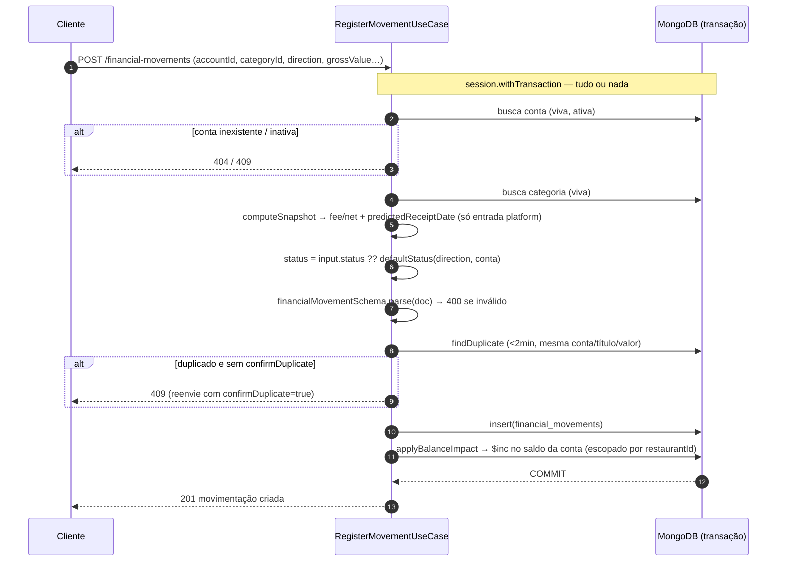
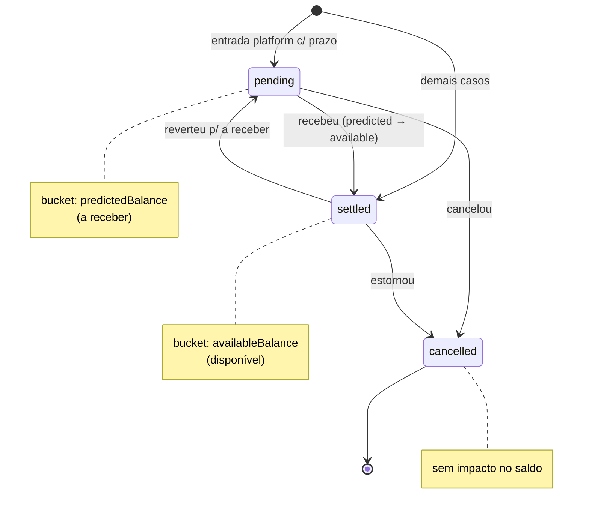

# 💸 MintlyApi — movimentações financeiras

O domínio mais complexo: cada movimentação (entrada/saída) é **transacional** e ajusta o saldo da conta no mesmo commit. Não usa o CRUD genérico — corpos e regras são dedicados.

Ver também: [Modelo de dinheiro](./dinheiro.md) (buckets, `$inc`) · [Mapa de domínio](./mapa-de-dominio.md).

---

## Registrar uma movimentação

Pontos-chave:

- **Snapshots (Extended Reference):** o doc guarda `account: { _id, name, type }` e `category: { _id, name, type }` — congela conta/categoria no momento do lançamento.
- **Taxa/líquido** só em **entrada de conta platform** (`computeSnapshot`); saída ou não-platform: `feeValue=0`, `netValue=grossValue`.
- **Status default** (`defaultStatus`): entrada em conta platform com prazo → `pending`; senão `settled`. Prazo só vale para recebimento (M7).
- **Duplicidade:** bloqueia lançamento idêntico em <2min salvo `confirmDuplicate=true`.
- **Saldo:** `applyBalanceImpact` faz `$inc` Decimal128 escopado por `restaurantId`; `matchedCount==0` → `NotFoundError` (sem drift silencioso).

---

## Ciclo de vida do status

O `status` decide o **bucket** do saldo. Mudanças passam por `PATCH /:id/status` (ou pelo `PATCH /:id` com `status`), sempre corrigindo o saldo na transação.

Cada transição **reverte** o efeito do status antigo e **aplica** o do novo. Ex.: `pending → settled` move o valor de `predictedBalance` para `availableBalance`; `→ cancelled` zera o impacto.

---

## Editar e reconciliar

- **`PATCH /:id` (update):** reconstrói o doc, recalcula fee/net e corrige o saldo — **reverte o efeito antigo na conta antiga** e **aplica o novo na conta nova** (retroativo resolve sozinho). `direction` é imutável; `status` é validado contra o enum (M8).
- **`POST /recompute-balances`:** reconcilia o saldo de uma conta a partir das movimentações (recalcula os dois buckets).

> ⚠️ **Dois limites conhecidos** (a validar — `PROBLEMAS-FUTUROS.md`):
> - **Liquidação por data não existe** (C3/P1): `pending` de platform não vira `settled` sozinho quando o `predictedReceiptDate` vence.
> - **PATCH re-precifica** (C4/P3): editar recomputa fee/net pela taxa **atual** da conta, não a do lançamento.
