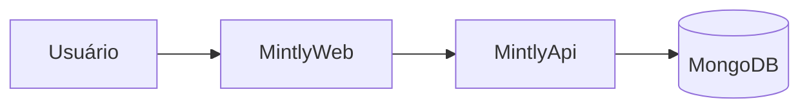

# Melhorias do Site de Documentos — Implementation Plan

> **For agentic workers:** REQUIRED SUB-SKILL: Use superpowers:subagent-driven-development (recommended) or superpowers:executing-plans to implement this plan task-by-task. Steps use checkbox (`- [ ]`) syntax for tracking.

**Goal:** Adicionar 8 melhorias ao site de documentos Astro: command palette (Cmd+K), PDF pesquisável, Office (docx/xlsx) inline, metadado de git por doc, Mermaid, sumário+tempo de leitura, checagem de links no CI e comentários Giscus.

**Architecture:** Continua site estático Astro → GitHub Pages, sem backend. Extração de PDF/docx/xlsx acontece no build (Node) via libs npm e alimenta tanto a renderização inline quanto o índice do Pagefind. Mermaid e Cmd+K rodam client-side. Giscus é um widget client-side ancorado no GitHub Discussions.

**Tech Stack:** Astro 5, TypeScript 5, Vitest 3, Pagefind, mammoth (docx), SheetJS/xlsx, pdf-parse (PDF), mermaid, linkinator (CI), Giscus.

**Base:** branch `feat/20260604/site-de-documentos` (já com o site funcionando). Trabalhar nela. Commits em PT.

---

## File Structure

**Criar:**
- `src/lib/extract.ts` — `extractDocxHtml`, `extractXlsxHtml`, `extractPdfText` (build-time)
- `src/lib/extract.spec.ts` — testes round-trip
- `src/lib/git-meta.ts` — `parseGitMeta` (puro) + `lastCommit` (execSync)
- `src/lib/git-meta.spec.ts` — teste do parser
- `src/lib/reading.ts` — `readingTimeMin` (puro) + `tocFromHeadings` (puro)
- `src/lib/reading.spec.ts` — testes
- `src/components/Giscus.astro` — widget de comentários
- `src/components/CommandPalette.astro` — Cmd+K (Pagefind modal)
- `scripts/make-test-pdf.mjs` — gera `docs/test/exemplo.pdf` (seed)
- `.github/workflows/ci.yml` — checagem de links em PR

**Modificar:**
- `package.json` — novas deps
- `astro.config.mjs` — `vite.ssr.external` p/ libs Node
- `src/components/viewers/PdfView.astro` — bloco oculto indexável
- `src/components/viewers/OfficeView.astro` — render inline (docx/xlsx)
- `src/components/viewers/MarkdownView.astro` — TOC + tempo de leitura + Mermaid
- `src/pages/[...path].astro` — computa extração + metadado git; passa aos viewers; inclui Giscus
- `src/layouts/BaseLayout.astro` — inclui CommandPalette
- `.github/workflows/deploy.yml` — `fetch-depth: 0` (histórico p/ metadado git)

---

### Task 1: Dependências, config Vite e seed de PDF

**Files:**
- Modify: `package.json`, `astro.config.mjs`
- Create: `scripts/make-test-pdf.mjs`, `docs/test/exemplo.pdf`

- [ ] **Step 1: Instalar dependências**

Run:
```
npm i mammoth xlsx pdf-parse mermaid
npm i -D linkinator pdf-lib unist-util-visit
```
Expected: instala sem erro. (`mammoth`, `xlsx`, `pdf-parse`, `mermaid` são deps de runtime/build; `linkinator`, `pdf-lib`, `unist-util-visit` são devDeps — o último p/ o plugin remark do Mermaid.)

- [ ] **Step 2: Configurar Vite SSR p/ as libs Node de extração**

Edit `astro.config.mjs` para:
```js
import { defineConfig } from 'astro/config'

export default defineConfig({
  site: 'https://mintly-autonomos.github.io',
  base: '/Documents',
  vite: {
    ssr: {
      external: ['pdf-parse', 'mammoth', 'xlsx'],
    },
  },
})
```
Motivo: essas libs CommonJS devem ser carregadas pelo Node no build, não empacotadas pelo Vite.

- [ ] **Step 3: Criar `scripts/make-test-pdf.mjs`** (gera um PDF de teste com texto extraível)

```js
// scripts/make-test-pdf.mjs
import { writeFileSync, mkdirSync } from 'node:fs'
import { PDFDocument, StandardFonts } from 'pdf-lib'

mkdirSync('docs/test', { recursive: true })
const pdf = await PDFDocument.create()
const font = await pdf.embedFont(StandardFonts.Helvetica)
const page = pdf.addPage([595, 842])
page.drawText('Documento PDF de teste — Mintly Docs', { x: 50, y: 780, size: 18, font })
page.drawText('Este texto deve ser indexavel pela busca full-text (Pagefind).', { x: 50, y: 750, size: 12, font })
writeFileSync('docs/test/exemplo.pdf', await pdf.save())
console.log('[make-test-pdf] gerado docs/test/exemplo.pdf')
```

- [ ] **Step 4: Gerar o PDF**

Run: `node scripts/make-test-pdf.mjs`
Expected: cria `docs/test/exemplo.pdf` (alguns KB).

- [ ] **Step 5: Build sanity**

Run: `npm run build`
Expected: build passa; `dist/files/test/exemplo.pdf` existe (sync copiou).

- [ ] **Step 6: Commit**

```
git add package.json package-lock.json astro.config.mjs scripts/make-test-pdf.mjs docs/test/exemplo.pdf
git commit -m "chore: deps de extracao/mermaid/linkinator e PDF de teste"
```

---

### Task 2: Lib de extração de conteúdo (TDD)

**Files:**
- Create: `src/lib/extract.ts`, `src/lib/extract.spec.ts`

- [ ] **Step 1: Escrever os testes round-trip que falham** `src/lib/extract.spec.ts`:

```ts
import { describe, it, expect } from 'vitest'
import { tmpdir } from 'node:os'
import { join } from 'node:path'
import { writeFileSync, mkdtempSync } from 'node:fs'
import { extractDocxHtml, extractXlsxHtml, extractPdfText } from './extract'

const dir = mkdtempSync(join(tmpdir(), 'extract-'))

describe('extract', () => {
  it('docx -> html contendo o texto', async () => {
    const { Document, Packer, Paragraph, TextRun } = await import('docx')
    const doc = new Document({ sections: [{ children: [new Paragraph({ children: [new TextRun('OlaDocx')] })] }] })
    const p = join(dir, 'a.docx'); writeFileSync(p, await Packer.toBuffer(doc))
    const html = await extractDocxHtml(p)
    expect(html).toContain('OlaDocx')
  })

  it('xlsx -> html de tabela contendo os valores', async () => {
    const ExcelJS = (await import('exceljs')).default
    const wb = new ExcelJS.Workbook(); const ws = wb.addWorksheet('S')
    ws.addRow(['CabA', 'CabB']); ws.addRow(['v1', 'v2'])
    const p = join(dir, 'a.xlsx'); writeFileSync(p, Buffer.from(await wb.xlsx.writeBuffer()))
    const html = await extractXlsxHtml(p)
    expect(html).toContain('<table')
    expect(html).toContain('CabA')
    expect(html).toContain('v2')
  })

  it('pdf -> texto contendo o conteudo', async () => {
    const { PDFDocument, StandardFonts } = await import('pdf-lib')
    const pdf = await PDFDocument.create(); const font = await pdf.embedFont(StandardFonts.Helvetica)
    pdf.addPage().drawText('TextoPdf123', { x: 50, y: 700, size: 14, font })
    const p = join(dir, 'a.pdf'); writeFileSync(p, await pdf.save())
    const text = await extractPdfText(p)
    expect(text).toContain('TextoPdf123')
  })
})
```
(Nota: `docx`, `exceljs`, `pdf-lib` já estão instalados — os dois primeiros vieram do script de seed Office, `pdf-lib` da Task 1.)

- [ ] **Step 2: Rodar p/ ver falhar**

Run: `npx vitest run src/lib/extract.spec.ts`
Expected: FAIL — módulo `./extract` inexistente.

- [ ] **Step 3: Implementar** `src/lib/extract.ts`:

```ts
import { createRequire } from 'node:module'
const require = createRequire(import.meta.url)

// pdf-parse: importar o lib interno evita o "debug mode" do index.js que lê um PDF de teste.
const pdfParse = require('pdf-parse/lib/pdf-parse.js') as (b: Buffer) => Promise<{ text: string }>
import { readFile } from 'node:fs/promises'

export async function extractPdfText (absPath: string): Promise<string> {
  const buf = await readFile(absPath)
  const { text } = await pdfParse(buf)
  return text.trim()
}

export async function extractDocxHtml (absPath: string): Promise<string> {
  const mammoth = require('mammoth') as typeof import('mammoth')
  const { value } = await mammoth.convertToHtml({ path: absPath })
  return value
}

export async function extractXlsxHtml (absPath: string): Promise<string> {
  const XLSX = require('xlsx') as typeof import('xlsx')
  const wb = XLSX.readFile(absPath)
  const first = wb.SheetNames[0]
  return XLSX.utils.sheet_to_html(wb.Sheets[first])
}
```

- [ ] **Step 4: Rodar p/ ver passar**

Run: `npx vitest run src/lib/extract.spec.ts`
Expected: PASS (3 testes).

- [ ] **Step 5: Commit**

```
git add src/lib/extract.ts src/lib/extract.spec.ts
git commit -m "feat: lib de extracao de conteudo (docx/xlsx/pdf) no build"
```

---

### Task 3: PDF pesquisável + Office inline (integração)

**Files:**
- Modify: `src/components/viewers/PdfView.astro`, `src/components/viewers/OfficeView.astro`, `src/pages/[...path].astro`

- [ ] **Step 1: PdfView — adicionar bloco oculto indexável**

Substituir o conteúdo de `src/components/viewers/PdfView.astro` por:
```astro
---
interface Props { src: string, name: string, text?: string }
const { src, name, text } = Astro.props
---
<div>
  <iframe src={src} title={name} style="width:100%;height:80vh;border:1px solid var(--border);border-radius:var(--radius);"></iframe>
  <p><a class="btn btn--ghost" href={src} download>⬇️ Baixar {name}</a></p>
  {text && <div data-pagefind-body hidden>{text}</div>}
</div>
```

- [ ] **Step 2: OfficeView — render inline quando houver HTML extraído**

Substituir o conteúdo de `src/components/viewers/OfficeView.astro` por:
```astro
---
interface Props { absoluteSrc: string, src: string, name: string, html?: string }
const { absoluteSrc, src, name, html } = Astro.props
const viewer = `https://view.officeapps.live.com/op/view.aspx?src=${encodeURIComponent(absoluteSrc)}`
---
<div>
  <div style="display:flex;gap:8px;flex-wrap:wrap;margin-bottom:12px;">
    <a class="btn btn--ghost" href={src} download>⬇️ Baixar {name}</a>
    <a class="btn btn--ghost" href={viewer} target="_blank" rel="noopener">👁️ Abrir no viewer da Microsoft</a>
  </div>
  {html
    ? <div class="office-inline" data-pagefind-body set:html={html} />
    : <div class="card"><p style="font-weight:600;">📊 {name}</p><p style="color:var(--muted-foreground);font-size:14px;">Pré-visualização inline não disponível para este formato — use baixar ou o viewer.</p></div>}
</div>
<style>
  .office-inline :global(table) { border-collapse: collapse; width: 100%; }
  .office-inline :global(td), .office-inline :global(th) { border: 1px solid var(--border); padding: 6px 10px; }
  .office-inline :global(img) { max-width: 100%; }
</style>
```

- [ ] **Step 3: catch-all — computar extração e passar aos viewers**

Em `src/pages/[...path].astro`, no frontmatter (após calcular `file`, `fileUrl`, `fileAbsUrl`), adicionar imports e a lógica de extração. Adicionar no topo:
```ts
import { join } from 'node:path'
import { extractPdfText, extractDocxHtml, extractXlsxHtml } from '../lib/extract'
```
E após `const fileAbsUrl = ...`:
```ts
const docsDir = fileURLToPath(new URL('../../docs', import.meta.url))
let pdfText: string | undefined
let officeHtml: string | undefined
if (file) {
  const abs = join(docsDir, file.path)
  const ext = file.name.toLowerCase().split('.').pop()
  if (file.kind === 'pdf') pdfText = await extractPdfText(abs).catch(() => undefined)
  else if (ext === 'docx') officeHtml = await extractDocxHtml(abs).catch(() => undefined)
  else if (ext === 'xlsx') officeHtml = await extractXlsxHtml(abs).catch(() => undefined)
}
```
Então atualizar as chamadas dos viewers:
```astro
{file.kind === 'pdf' && <PdfView src={fileUrl} name={file.name} text={pdfText} />}
{file.kind === 'office' && <OfficeView absoluteSrc={fileAbsUrl} src={fileUrl} name={file.name} html={officeHtml} />}
```

- [ ] **Step 4: Build + smoke**

Run: `npm run build`
Then inspect `dist/`:
- `dist/test/exemplo.docx/index.html` deve conter o texto do docx (procurar `OlaDocx`? não — o seed real diz "Documento de teste — Mintly Docs"); confirme que há uma `<div class="office-inline"` com conteúdo.
- `dist/test/exemplo.xlsx/index.html` deve conter `<table`.
- `dist/test/exemplo.pdf/index.html` deve conter um `<div data-pagefind-body hidden>` com o texto.
- Pagefind agora deve indexar mais páginas (PDF/docx/xlsx). Verifique no output do build o nº de páginas indexadas (>1).

Report o que encontrou.

- [ ] **Step 5: Commit**

```
git add src/components/viewers/PdfView.astro src/components/viewers/OfficeView.astro "src/pages/[...path].astro"
git commit -m "feat: PDF pesquisavel e Office (docx/xlsx) renderizado inline"
```

---

### Task 4: Metadado de git por documento

**Files:**
- Create: `src/lib/git-meta.ts`, `src/lib/git-meta.spec.ts`
- Modify: `src/pages/[...path].astro`, `.github/workflows/deploy.yml`

- [ ] **Step 1: Teste do parser (TDD)** `src/lib/git-meta.spec.ts`:

```ts
import { describe, it, expect } from 'vitest'
import { parseGitMeta } from './git-meta'

describe('parseGitMeta', () => {
  it('parseia "ISO\\tAutor"', () => {
    expect(parseGitMeta('2026-06-04T10:00:00-03:00\tAlexandre')).toEqual({
      date: '2026-06-04T10:00:00-03:00', author: 'Alexandre',
    })
  })
  it('retorna null para string vazia', () => {
    expect(parseGitMeta('')).toBeNull()
  })
})
```

- [ ] **Step 2: Rodar p/ ver falhar**

Run: `npx vitest run src/lib/git-meta.spec.ts` → FAIL.

- [ ] **Step 3: Implementar** `src/lib/git-meta.ts`:

```ts
import { execFileSync } from 'node:child_process'

export interface GitMeta { date: string, author: string }

export function parseGitMeta (line: string): GitMeta | null {
  if (!line) return null
  const [date, author] = line.split('\t')
  if (!date || !author) return null
  return { date, author }
}

export function lastCommit (repoDir: string, relPath: string): GitMeta | null {
  try {
    const out = execFileSync('git', ['log', '-1', '--format=%aI%x09%an', '--', relPath], {
      cwd: repoDir, encoding: 'utf8',
    }).trim()
    return parseGitMeta(out)
  } catch {
    return null
  }
}
```

- [ ] **Step 4: Rodar p/ ver passar** → `npx vitest run src/lib/git-meta.spec.ts` PASS.

- [ ] **Step 5: Mostrar no catch-all (páginas de arquivo)**

Em `src/pages/[...path].astro`, importar e calcular o metadado para arquivos:
```ts
import { lastCommit } from '../lib/git-meta'
```
No frontmatter, dentro do `if (file)` (ou logo após), adicionar:
```ts
const meta = file ? lastCommit(fileURLToPath(new URL('../../', import.meta.url)), `docs/${file.path}`) : null
```
E no template, logo abaixo do `<FileActions .../>`:
```astro
{meta && (
  <p style="color:var(--muted-foreground);font-size:13px;margin:-8px 0 16px;">
    Atualizado em {new Date(meta.date).toLocaleDateString('pt-BR')} por {meta.author}
  </p>
)}
```

- [ ] **Step 6: Garantir histórico no CI**

Em `.github/workflows/deploy.yml`, no step de checkout do job `build`, adicionar `fetch-depth: 0`:
```yaml
      - uses: actions/checkout@v4
        with:
          fetch-depth: 0
```
Motivo: sem isso o checkout traz 1 commit só e o `git log` por arquivo fica errado.

- [ ] **Step 7: Build + commit**

Run: `npm run build` (deve passar; localmente o git log funciona).
```
git add src/lib/git-meta.ts src/lib/git-meta.spec.ts "src/pages/[...path].astro" .github/workflows/deploy.yml
git commit -m "feat: exibir ultima atualizacao (data/autor) por documento via git"
```

---

### Task 5: Sumário (TOC) + tempo de leitura no Markdown

**Files:**
- Create: `src/lib/reading.ts`, `src/lib/reading.spec.ts`
- Modify: `src/components/viewers/MarkdownView.astro`

- [ ] **Step 1: Testes (TDD)** `src/lib/reading.spec.ts`:

```ts
import { describe, it, expect } from 'vitest'
import { readingTimeMin, tocFromHeadings } from './reading'

describe('readingTimeMin', () => {
  it('arredonda pra cima, minimo 1', () => {
    expect(readingTimeMin('uma duas tres')).toBe(1)
    expect(readingTimeMin(Array(401).fill('x').join(' '))).toBe(3)
  })
})

describe('tocFromHeadings', () => {
  it('mantem apenas depth 2 e 3', () => {
    const toc = tocFromHeadings([
      { depth: 1, slug: 'a', text: 'A' },
      { depth: 2, slug: 'b', text: 'B' },
      { depth: 3, slug: 'c', text: 'C' },
      { depth: 4, slug: 'd', text: 'D' },
    ])
    expect(toc.map((h) => h.slug)).toEqual(['b', 'c'])
  })
})
```

- [ ] **Step 2: Rodar p/ ver falhar** → FAIL.

- [ ] **Step 3: Implementar** `src/lib/reading.ts`:

```ts
export interface Heading { depth: number, slug: string, text: string }

export function readingTimeMin (raw: string): number {
  const words = raw.trim().split(/\s+/).filter(Boolean).length
  return Math.max(1, Math.ceil(words / 200))
}

export function tocFromHeadings (headings: Heading[]): Heading[] {
  return headings.filter((h) => h.depth === 2 || h.depth === 3)
}
```

- [ ] **Step 4: Rodar p/ ver passar** → PASS.

- [ ] **Step 5: Usar no MarkdownView**

Atualizar `src/components/viewers/MarkdownView.astro` para calcular e exibir. Substituir o frontmatter e o corpo por:
```astro
---
import type { CollectionEntry } from 'astro:content'
import { render } from 'astro:content'
import { readingTimeMin, tocFromHeadings } from '../../lib/reading'
interface Props { entry: CollectionEntry<'docs'> }
const { entry } = Astro.props
const { Content, headings } = await render(entry)
const minutes = readingTimeMin(entry.body ?? '')
const toc = tocFromHeadings(headings)
---
<p style="color:var(--muted-foreground);font-size:13px;">⏱️ {minutes} min de leitura</p>
{toc.length > 0 && (
  <details class="toc" open>
    <summary style="cursor:pointer;color:var(--muted-foreground);">Nesta página</summary>
    <ul>
      {toc.map((h) => (
        <li style={`margin-left:${(h.depth - 2) * 14}px;`}><a href={`#${h.slug}`}>{h.text}</a></li>
      ))}
    </ul>
  </details>
)}
<article class="prose" data-pagefind-body>
  <Content />
</article>
<style>
  .toc { border:1px solid var(--border); border-radius: var(--radius); padding: 10px 14px; margin: 8px 0 20px; background: var(--card); }
  .toc ul { list-style:none; padding:0; margin:8px 0 0; line-height:1.9; }
  .prose { line-height: 1.7; }
  .prose :global(h1) { margin-top: 0; }
  .prose :global(pre) { background: var(--muted); padding: 14px; border-radius: var(--radius); overflow:auto; }
  .prose :global(code) { background: var(--muted); padding: 1px 5px; border-radius: 6px; }
  .prose :global(img) { max-width: 100%; border-radius: var(--radius); }
  .prose :global(table) { border-collapse: collapse; }
  .prose :global(td), .prose :global(th) { border: 1px solid var(--border); padding: 6px 10px; }
</style>
```

- [ ] **Step 6: Build + commit**

Run: `npm run build` (passa).
```
git add src/lib/reading.ts src/lib/reading.spec.ts src/components/viewers/MarkdownView.astro
git commit -m "feat: sumario (TOC) e tempo de leitura nas paginas markdown"
```

---

### Task 6: Mermaid (client-side)

**Files:**
- Modify: `astro.config.mjs`, `src/components/viewers/MarkdownView.astro`

- [ ] **Step 1: Plugin remark p/ marcar blocos mermaid**

O highlighter padrão do Astro (Shiki) NÃO emite a classe `language-mermaid`, então não dá pra confiar num seletor de classe. A forma robusta é um plugin remark que, ANTES do highlight, transforma o nó `code` com `lang === 'mermaid'` num HTML cru `<pre class="mermaid">…</pre>` (bypassa o Shiki).

Editar `astro.config.mjs` para adicionar o plugin (mantendo a config de `vite.ssr` da Task 1):
```js
import { defineConfig } from 'astro/config'
import { visit } from 'unist-util-visit'

function remarkMermaid () {
  return (tree) => {
    visit(tree, 'code', (node) => {
      if (node.lang === 'mermaid') {
        node.type = 'html'
        node.value = `<pre class="mermaid">${node.value}</pre>`
      }
    })
  }
}

export default defineConfig({
  site: 'https://mintly-autonomos.github.io',
  base: '/Documents',
  markdown: {
    remarkPlugins: [remarkMermaid],
  },
  vite: {
    ssr: {
      external: ['pdf-parse', 'mammoth', 'xlsx'],
    },
  },
})
```

- [ ] **Step 2: Script de render no MarkdownView**

Ao final de `src/components/viewers/MarkdownView.astro` (depois do `<style>`), adicionar:
```astro
<script>
  // Renderiza os <pre class="mermaid"> client-side, carregando mermaid sob demanda.
  const blocks = document.querySelectorAll('pre.mermaid')
  if (blocks.length > 0) {
    const { default: mermaid } = await import('mermaid')
    mermaid.initialize({ startOnLoad: false, theme: document.documentElement.classList.contains('dark') ? 'dark' : 'default' })
    await mermaid.run({ nodes: blocks })
  }
</script>
```
Nota: `import('mermaid')` é dinâmico, então o mermaid só é baixado em páginas que têm diagrama. Astro empacota o módulo (sem CDN).

- [ ] **Step 3: Seed de teste — adicionar um diagrama Mermaid a um doc**

Criar `docs/diagrams/fluxo-exemplo.md`:
````md
# Fluxo de exemplo (Mermaid)


````

- [ ] **Step 4: Build + smoke**

Run: `npm run build && npm run preview`
Abrir `http://localhost:4321/Documents/diagrams/fluxo-exemplo.md` e confirmar que o diagrama renderiza (não fica como bloco de código). Report.

- [ ] **Step 5: Commit**

```
git add astro.config.mjs src/components/viewers/MarkdownView.astro docs/diagrams/fluxo-exemplo.md
git commit -m "feat: render de diagramas mermaid client-side no markdown"
```

---

### Task 7: Command palette (Cmd/Ctrl + K)

**Files:**
- Create: `src/components/CommandPalette.astro`
- Modify: `src/layouts/BaseLayout.astro`

- [ ] **Step 1: Criar `src/components/CommandPalette.astro`**

```astro
---
const base = import.meta.env.BASE_URL
---
<div id="cmdk"></div>
<link href={`${base}/pagefind/pagefind-modular-ui.css`} rel="stylesheet" />
<script is:inline define:vars={{ base }}>
  window.addEventListener('DOMContentLoaded', async () => {
    // Pagefind Modal UI — abre com Cmd/Ctrl+K.
    try {
      const { PagefindModalUI } = await import(`${base}/pagefind/pagefind-modular-ui.js`)
      const modal = new PagefindModalUI({ showImages: false })
      window.addEventListener('keydown', (e) => {
        if ((e.metaKey || e.ctrlKey) && e.key.toLowerCase() === 'k') { e.preventDefault(); modal.open() }
      })
    } catch (err) { /* índice ainda não gerado (dev) */ }
  })
</script>
```
IMPORTANTE: confirmar os nomes reais dos assets do modal gerados pelo Pagefind em `dist/pagefind/` após um build (pode ser `pagefind-modular-ui.js`/`.css`). Se os nomes diferirem, ajustar os caminhos e a API de abertura conforme a versão instalada (checar `dist/pagefind/` e a doc do Pagefind Modular UI). Garantir que o atalho Cmd/Ctrl+K abre o modal e a busca retorna resultados.

- [ ] **Step 2: Incluir no BaseLayout**

Em `src/layouts/BaseLayout.astro`, importar e renderizar o componente no fim do `<body>` (após o `<slot />`):
```astro
import CommandPalette from '../components/CommandPalette.astro'
```
```astro
    <slot />
    <CommandPalette />
```
E no header, adicionar uma dica visual no botão Buscar (opcional): trocar o texto para `🔎 Buscar ⌘K`.

- [ ] **Step 3: Build + smoke**

Run: `npm run build && npm run preview`
Em qualquer página, apertar Ctrl+K → o modal de busca abre e encontra "Sapphire"/"Mintly". Report se os nomes de asset precisaram de ajuste.

- [ ] **Step 4: Commit**

```
git add src/components/CommandPalette.astro src/layouts/BaseLayout.astro
git commit -m "feat: command palette de busca com atalho Cmd/Ctrl+K"
```

---

### Task 8: Comentários via Giscus

**Files:**
- Create: `src/components/Giscus.astro`
- Modify: `src/pages/[...path].astro`

- [ ] **Step 1: Criar `src/components/Giscus.astro`** (com placeholders dos IDs)

```astro
---
// SETUP MANUAL (uma vez): habilitar Discussions no repo Mintly-Autonomos/Documents,
// instalar o app https://github.com/apps/giscus, e gerar os IDs em https://giscus.app.
// Cole repoId e categoryId abaixo.
const REPO = 'Mintly-Autonomos/Documents'
const REPO_ID = 'COLE_O_REPO_ID_AQUI'
const CATEGORY = 'Announcements'
const CATEGORY_ID = 'COLE_O_CATEGORY_ID_AQUI'
const configured = !REPO_ID.startsWith('COLE_')
---
{configured ? (
  <section style="margin-top:40px;border-top:1px solid var(--border);padding-top:20px;">
    <script src="https://giscus.app/client.js"
      data-repo={REPO}
      data-repo-id={REPO_ID}
      data-category={CATEGORY}
      data-category-id={CATEGORY_ID}
      data-mapping="pathname"
      data-reactions-enabled="1"
      data-theme="preferred_color_scheme"
      data-lang="pt"
      crossorigin="anonymous"
      async></script>
  </section>
) : null}
```
Nota: enquanto os IDs não forem colados, o componente não renderiza nada (não quebra o site).

- [ ] **Step 2: Incluir nas páginas de arquivo do catch-all**

Em `src/pages/[...path].astro`, importar:
```ts
import Giscus from '../components/Giscus.astro'
```
E dentro do bloco `{file && (...)}`, ao final (após os viewers), adicionar `<Giscus />`.

- [ ] **Step 3: Build + commit**

Run: `npm run build` (passa; Giscus não renderiza sem IDs).
```
git add src/components/Giscus.astro "src/pages/[...path].astro"
git commit -m "feat: comentarios via giscus nas paginas de documento (placeholders de ID)"
```

- [ ] **Step 4: Documentar o setup manual no relatório**

Reportar claramente que para ativar comentários é preciso: (1) Settings → General → habilitar Discussions; (2) instalar o app giscus no repo; (3) pegar `repoId` e `categoryId` em giscus.app e colar em `Giscus.astro`.

---

### Task 9: Checagem de links quebrados no CI

**Files:**
- Create: `.github/workflows/ci.yml`

- [ ] **Step 1: Criar `.github/workflows/ci.yml`**

```yaml
name: CI
on:
  pull_request:
    branches: [main]
  workflow_dispatch:
jobs:
  links:
    runs-on: ubuntu-latest
    steps:
      - uses: actions/checkout@v4
      - uses: actions/setup-node@v4
        with:
          node-version: 22
      - run: npm ci
      - run: npm run build
      - name: Checar links internos no dist
        run: npx linkinator dist --recurse --silent --skip "^https?://"
```
Nota: `--skip "^https?://"` ignora links externos (foco em links internos quebrados). `--recurse` segue as páginas geradas.

- [ ] **Step 2: Validar o linkinator localmente**

Run: `npm run build && npx linkinator dist --recurse --silent --skip "^https?://"`
Expected: termina sem links internos quebrados (exit 0). Se acusar algum link quebrado real, reportar como DONE_WITH_CONCERNS com a lista (pode indicar bug de roteamento a investigar).

- [ ] **Step 3: Commit**

```
git add .github/workflows/ci.yml
git commit -m "ci: checagem de links internos quebrados em PRs (linkinator)"
```

---

### Task 10: Verificação final + atualizar PR

- [ ] **Step 1: Suíte + build limpos**

Run: `npm test && npm run build`
Expected: todos os testes passam (file-kind, content-tree, github-links, search-index, extract, git-meta, reading); build gera dist com Pagefind indexando markdown + PDF + docx + xlsx.

- [ ] **Step 2: Smoke final no preview**

Run: `npm run preview` e conferir:
- Ctrl+K abre busca; acha texto de um PDF (ex.: "indexavel")
- `test/exemplo.docx` e `.xlsx` aparecem renderizados inline
- `diagrams/fluxo-exemplo.md` mostra o diagrama Mermaid
- páginas de arquivo mostram "Atualizado em …"
- markdown longo mostra TOC + tempo de leitura

- [ ] **Step 3: Push (a branch já tem PR #1 aberto — o push atualiza o PR)**

```
git push
```

- [ ] **Step 4: Comentar no PR o que mudou**

Adicionar um comentário no PR #1 resumindo a leva de melhorias e os passos manuais pendentes (habilitar Pages; opcionalmente configurar Giscus).

---

## Notas de implementação

- **Pagefind indexa mais páginas agora:** markdown (já marcado), PDF (texto oculto), docx/xlsx (inline). pptx continua fora do índice (sem extração).
- **Mermaid e Cmd+K** dependem de JS no cliente; em `astro dev` a busca full-text não existe (índice só no build) — testar via `build` + `preview`.
- **Giscus** exige Discussions habilitado + app instalado + IDs; sem isso o componente fica inerte (não quebra).
- **Metadado git** depende de histórico: `fetch-depth: 0` no checkout do deploy.
- **Risco de bundling:** `pdf-parse`/`mammoth`/`xlsx` são CommonJS usados no SSR/build — `vite.ssr.external` evita problemas. Se o build reclamar, conferir essa config primeiro.
